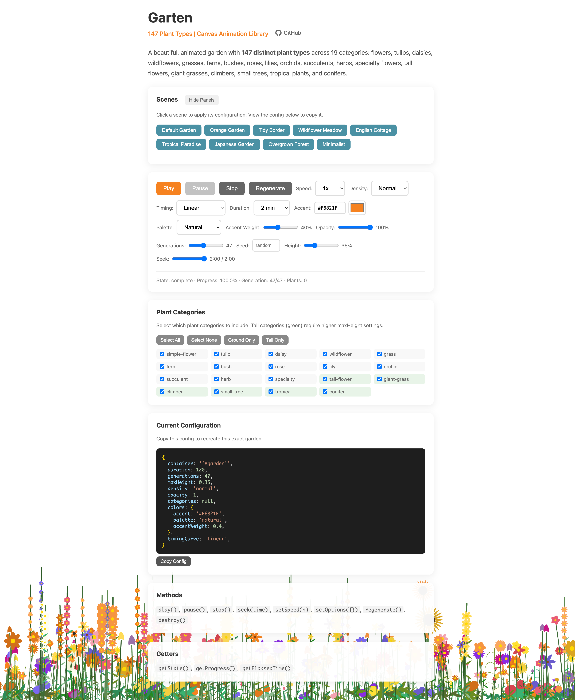

# Garten

An animated canvas garden that grows over time. Add a living, breathing background to any webpage with zero dependencies.

## What it does

Garten renders an animated garden of flowers, grasses, and foliage that gradually fills the bottom of a container. Plants grow in waves called "generations" — each wave adds new plants that sprout, grow stems, and bloom with flowers. The animation runs for a configurable duration (default 10 minutes) and can loop continuously.

**147 plant types** across 19 categories: simple flowers, tulips, daisies, wildflowers, grasses, ferns, bushes, roses, lilies, orchids, succulents, herbs, specialty flowers, tall flowers (hollyhocks, delphiniums, foxgloves), giant grasses (bamboo, miscanthus), climbers (wisteria, clematis), small trees (birch, willow, cherry blossom), tropical plants (palms, bird of paradise), and conifers (pine, cypress, juniper).

Take a look at an interactive demo: https://adewale.github.io/garten/



## Install

```bash
npm install garten
```

Or use the CDN:

```html
<script src="https://unpkg.com/garten/dist/index.global.js"></script>
```

## Quick Start

```typescript
import { Garten } from 'garten';

const garden = new Garten({
  container: '#my-container'
});
```

That's it. The garden starts growing automatically.

## Full Example

```typescript
import { Garten } from 'garten';

const garden = new Garten({
  container: '#garden',

  // Timing
  duration: 300,           // 5 minutes total
  generations: 30,         // 30 waves of growth
  speed: 1,                // Playback speed (2 = double speed)
  timingCurve: 'ease-out', // Fast start, slow finish

  // Appearance
  maxHeight: 0.4,          // Plants fill bottom 40% of container
  density: 'dense',        // 'sparse' | 'normal' | 'dense' | 'lush'

  // Colors
  colors: {
    accent: '#F6821F',     // Cloudflare orange (default)
    palette: 'natural',    // 'natural' | 'warm' | 'cool' | 'vibrant' | 'grayscale' | 'monotone'
    accentWeight: 0.4,     // 40% of flowers use accent color
  },

  // Behavior
  autoplay: true,
  loop: false,
  seed: 12345,             // Deterministic garden (omit for random)

  // Callbacks
  events: {
    onProgress: (progress) => console.log(`${(progress * 100).toFixed(0)}%`),
    onComplete: () => console.log('Garden complete'),
  }
});
```

## API

### Constructor Options

Only `container` is required. Everything else has sensible defaults.

**Required:**

| Option | Type | Description |
|--------|------|-------------|
| `container` | `string \| HTMLElement` | CSS selector or element |

**Common options** you might want to customize:

| Option | Type | Default | Description |
|--------|------|---------|-------------|
| `duration` | `number` | `600` | Total animation time in seconds (10 min) |
| `maxHeight` | `number` | `0.35` | Max plant height (0-1). Higher values add taller plants (trees at 1.0) |
| `density` | `'sparse'` \| `'normal'` \| `'dense'` \| `'lush'` | `'normal'` | How many plants |
| `colors.accent` | `string` | `'#F6821F'` | Primary accent color (hex) |
| `colors.palette` | `'natural'` \| `'warm'` \| `'cool'` \| `'vibrant'` \| `'grayscale'` \| `'monotone'` | `'natural'` | Color palette |
| `categories` | `string[]` | all | Filter to specific plant categories (e.g., `['rose', 'tulip']`) |
| `speed` | `number` | `1` | Playback speed multiplier |
| `loop` | `boolean` | `false` | Restart when complete |
| `seed` | `number` | random | Fixed seed for reproducible gardens |

<details>
<summary><strong>All options</strong> (click to expand)</summary>

**Timing:**

| Option | Type | Default | Description |
|--------|------|---------|-------------|
| `duration` | `number` | `600` | Total animation time in seconds |
| `generations` | `number` | `47` | Number of plant waves |
| `speed` | `number` | `1` | Playback speed multiplier |
| `timingCurve` | `string \| number` | `'linear'` | `'linear'` \| `'ease-out'` \| `'ease-in'` \| `'ease-in-out'` \| custom exponent |
| `autoplay` | `boolean` | `true` | Start automatically |
| `loop` | `boolean` | `false` | Restart when complete |

**Appearance:**

| Option | Type | Default | Description |
|--------|------|---------|-------------|
| `maxHeight` | `number` | `0.35` | Max plant height (0-1). Higher values add taller plants (trees at 1.0) |
| `density` | `string` | `'normal'` | `'sparse'` \| `'normal'` \| `'dense'` \| `'lush'` |
| `categories` | `string[]` | all | Filter to specific plant categories |
| `colors.accent` | `string` | `'#F6821F'` | Primary accent color |
| `colors.palette` | `string` | `'natural'` | Color palette preset |
| `colors.accentWeight` | `number` | `0.4` | Fraction of plants using accent color (0-1) |
| `colors.flowerColors` | `string[]` | `[]` | Custom flower colors (overrides palette) |
| `colors.foliageColors` | `string[]` | `[]` | Custom leaf/stem colors (overrides palette) |
| `background` | `string` | `'transparent'` | Canvas background. Any CSS color, or `'transparent'` to let the page show through (works on dark pages) |
| `opacity` | `number` | `1` | Global opacity (0-1) |
| `zIndex` | `number` | `-1` | CSS z-index for canvas |
| `fadeHeight` | `number` | `0` | Fade-out zone height as fraction (0-1) |
| `fadeColor` | `string` | `'#ffffff'` | Color the fade blends into (match your page background) |

**Performance:**

| Option | Type | Default | Description |
|--------|------|---------|-------------|
| `targetFPS` | `number` | `30` | Frame rate limit |
| `maxPixelRatio` | `number` | `2` | Device pixel ratio limit |
| `respectReducedMotion` | `boolean` | `true` | Honor `prefers-reduced-motion` |

**Determinism:**

| Option | Type | Default | Description |
|--------|------|---------|-------------|
| `seed` | `number` | random | RNG seed for reproducible gardens |

The generator uses integer hashing (no floating-point transcendentals), so
the same seed produces the same garden in every browser and JS engine.

**Accessibility:** when `respectReducedMotion` is enabled (the default) and the
user prefers reduced motion, the garden renders fully grown as a static image.
An explicit `play()` call still animates — a direct user action is treated as
consent to motion.

</details>

### Methods

```typescript
garden.play()              // Start, or resume from pause()/seek() position
garden.pause()             // Pause animation
garden.stop()              // Stop and reset to beginning
garden.seek(seconds)       // Jump to specific time (then play() resumes there)
garden.setSpeed(2)         // Change playback speed (positive finite, clamped to 0.01-100)
garden.setOptions({...})   // Update options (regenerates plants if needed)
garden.regenerate()        // Force new random garden
garden.destroy()           // Clean up and remove canvas (all later calls are no-ops)
```

Note: `container` cannot be changed via `setOptions()` — destroy the instance
and create a new one instead.

### Getters

```typescript
garden.getState()          // 'idle' | 'playing' | 'paused' | 'complete'
garden.getProgress()       // 0 to 1
garden.getElapsedTime()    // Seconds elapsed
```

### Events

Two equivalent ways to observe the garden. Constructor callbacks:

```typescript
events: {
  onStateChange: (state: PlaybackState) => void,
  onProgress: (progress: number, elapsed: number) => void,
  onGenerationComplete: (generation: number, total: number) => void,
  onComplete: () => void,
}
```

Or subscribe/unsubscribe at any time:

```typescript
const off = garden.on('generationComplete', ({ generation, totalGenerations }) => {
  console.log(`${generation}/${totalGenerations}`);
});
garden.once('complete', () => console.log('done'));
garden.on('stateChange', ({ state }) => console.log(state));
off(); // unsubscribe

// Available events: 'play' | 'pause' | 'stop' | 'complete' | 'progress'
//   | 'generationComplete' | 'stateChange' | 'regenerate' | 'optionsChange'
```

`generationComplete` fires once per generation in order, even when several
generations elapse between frames (e.g. a background tab catching up).
`seek()` does not fire events for the boundaries it jumps across.

### Cleanup (Important for SPAs)

Always call `destroy()` when removing the garden from the DOM to prevent memory leaks:

```typescript
// React
useEffect(() => {
  const garden = new Garten({ container: containerRef.current });
  return () => garden.destroy();
}, []);

// Vue
onUnmounted(() => garden.destroy());

// Vanilla JS (page navigation)
window.addEventListener('beforeunload', () => garden.destroy());
```

## Timing Curves

Control how generations are paced:

| Curve | Effect |
|-------|--------|
| `'linear'` | Even pacing throughout |
| `'ease-out'` | Fast start, slowing down toward the end |
| `'ease-in'` | Slow start, speeding up toward the end |
| `'ease-in-out'` | Slow start and end, fast middle |
| `2.5` | Custom exponent (>1 = ease-out, <1 = ease-in) |

## Presets

Pre-configured garden setups for common use cases:

```typescript
import { applyPreset, Garten } from 'garten';

const garden = new Garten({
  container: '#garden',
  ...applyPreset('forest'),
});
```

| Preset | Description |
|--------|-------------|
| `default` | Balanced garden with moderate density |
| `demo` | Fast 30-second animation for demos |
| `subtle` | Sparse, semi-transparent website background |
| `lush` | Dense, vibrant garden with max coverage |
| `forest` | Tall plants: trees, climbers, giant grasses |
| `meadow` | Low wildflower meadow with grasses |
| `roseGarden` | Elegant rose-focused garden |
| `tropical` | Palms and exotic flowers |
| `herbs` | Fragrant herb garden |
| `succulent` | Low-maintenance succulents |
| `ambient` | 1-hour looping background animation |
| `performance` | Optimized for lower-end devices |

## Themes

Visual styling presets that control colors:

```typescript
import { applyTheme, Garten } from 'garten';

const garden = new Garten({
  container: '#garden',
  ...applyTheme('sakura'),
});
```

| Theme | Description |
|-------|-------------|
| `natural` | Balanced, realistic colors (default) |
| `sunset` | Warm oranges, reds, yellows |
| `ocean` | Cool blues and greens |
| `grayscale` | Elegant black and white |
| `vibrant` | High-saturation colors |
| `sakura` | Cherry blossom pinks |
| `lavender` | Purple lavender field |
| `autumn` | Warm earth tones |
| `midnight` | Deep, cool night colors |
| `tropical` | Bright tropical colors |
| `zen` | Minimalist, muted tones |

### Combining Presets and Themes

```typescript
import { createConfig, Garten } from 'garten';

// Forest preset with autumn theme
const garden = new Garten({
  container: '#garden',
  ...createConfig('forest', 'autumn'),
});
```

## CSS Setup

The canvas is positioned absolutely. Your container needs positioning:

```css
#garden {
  position: relative;  /* or fixed/absolute */
  height: 400px;       /* needs explicit height */
}
```

For a full-page background:

```css
#garden {
  position: fixed;
  inset: 0;
  z-index: -1;
}
```

## CDN Usage

```html
<div id="garden" style="position: fixed; inset: 0; z-index: -1;"></div>
<script src="https://unpkg.com/garten/dist/index.global.js"></script>
<script>
  new Garten.Garten({ container: '#garden' });
</script>
```

## TypeScript

```typescript
// Core types
import type {
  GardenOptions,
  GardenController,
  GardenEvents,
  PlaybackState,
  ColorOptions,
  ColorPalette,
  Density,
  TimingCurve,
} from 'garten';

// Preset and theme types
import type { GardenPreset, GardenTheme } from 'garten';

// Enums
import { PlantType, PlantCategory } from 'garten';

// Helper functions
import {
  applyPreset,
  applyTheme,
  createConfig,
  getPresetNames,
  getThemeNames,
  createPreset,
  createTheme,
} from 'garten';

// Constants
import { PLANT_CATEGORIES } from 'garten';
```

### Helper Functions

| Function | Description |
|----------|-------------|
| `applyPreset(name, options?)` | Apply a preset to options |
| `applyTheme(name, options?)` | Apply a theme to options |
| `createConfig(preset, theme, options?)` | Combine preset + theme |
| `getPresetNames()` | List available preset names |
| `getThemeNames()` | List available theme names |
| `createPreset(name, options, description?)` | Create custom preset |
| `createTheme(name, config)` | Create custom theme |

### Category Filtering

```typescript
import { PLANT_CATEGORIES } from 'garten';

// Filter to specific plant categories
const garden = new Garten({
  container: '#garden',
  categories: ['rose', 'tulip', 'daisy'], // string names
});

// Available categories (19 total):
// 'simple-flower', 'tulip', 'daisy', 'wildflower', 'grass', 'fern',
// 'bush', 'rose', 'lily', 'orchid', 'succulent', 'herb', 'specialty',
// 'tall-flower', 'giant-grass', 'climber', 'small-tree', 'tropical', 'conifer'
```

## Browser Support

Chrome 64+, Firefox 69+, Safari 12+, Edge 79+

## License

MIT
